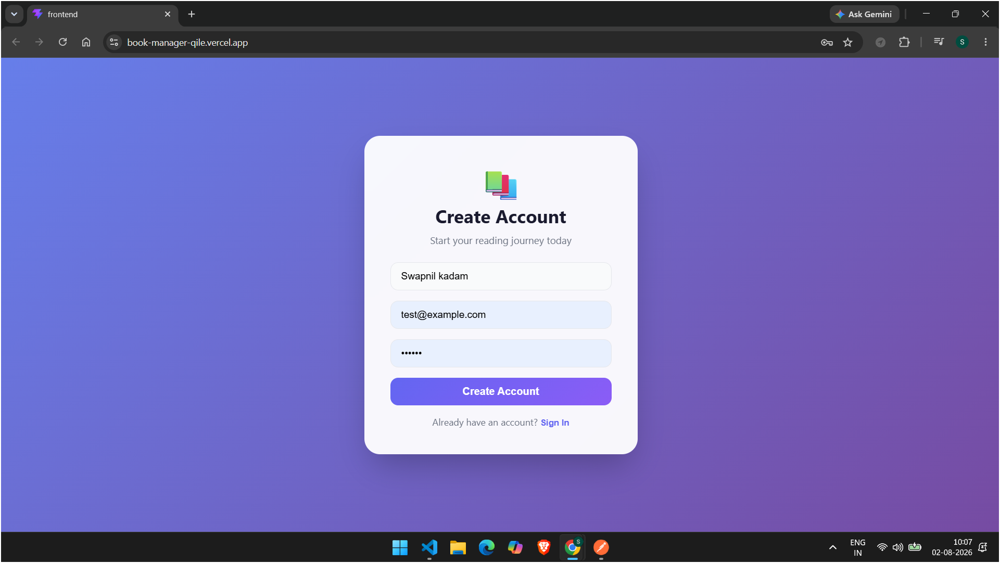
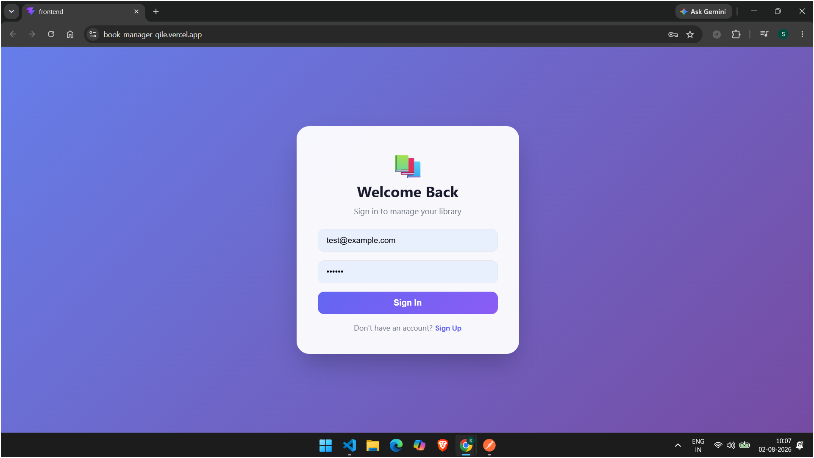
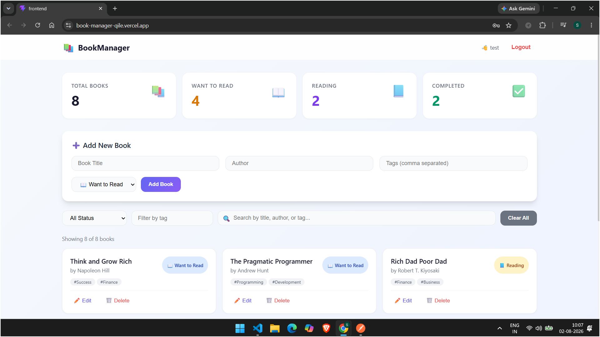
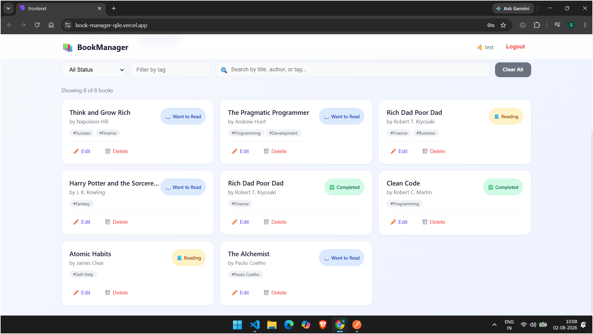
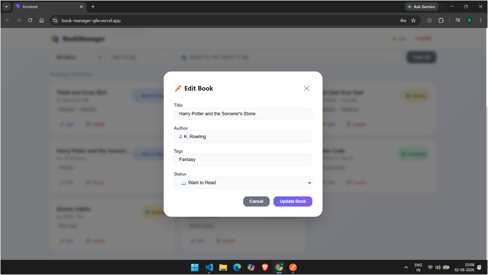

# 📚 Personal Book Manager

<div align="center">

# 📖 Personal Book Manager

*A modern full-stack Book Management application built using the MERN Stack with Next.js.*

🌐 **Live Demo:** https://book-manager-qile.vercel.app/

</div>

---

# 📸 Application Screenshots

> Save all screenshots inside the **screenshots** folder.

## 📁 Project Folder Structure

---

## 📝 Sign Up Page



---

## 🔐 Login Page



---

## 📊 Dashboard



---

## 📚 Book Collection



---

## ✏️ Edit Book



---

# 📂 Project Structure

```text
Personal-Book-Manager/
│
├── backend/
│   ├── config/
│   ├── controllers/
│   ├── middleware/
│   ├── models/
│   ├── routes/
│   ├── app.js
│   ├── package.json
│   └── .env.example
│
├── frontend/
│   ├── app/
│   ├── components/
│   ├── hooks/
│   ├── lib/
│   ├── public/
│   ├── styles/
│   ├── package.json
│   └── .env.local.example
│
├── screenshots/
│   ├── folder-structure.png
│   ├── signup.png
│   ├── login.png
│   ├── dashboard.png
│   ├── books.png
│   └── edit-book.png
│
├── README.md
└── .gitignore
```

# 📂 Screenshot Folder

```text
screenshots/
│
├── folder-structure.png
├── signup.png
├── login.png
├── dashboard.png
├── books.png
└── edit-book.png
```

---

# ✨ Features

- 🔐 Secure JWT Authentication
- 👤 User Registration & Login
- ➕ Add New Books
- ✏️ Edit Existing Books
- ❌ Delete Books
- 📖 Track Reading Status
- 🏷️ Filter Books by Tags
- 📊 Dashboard with Statistics
- 📱 Responsive Design
- ☁️ MongoDB Atlas Database
- 🚀 Vercel Deployment

---

# 🛠️ Tech Stack

### Frontend
- Next.js
- React.js
- Tailwind CSS
- Axios

### Backend
- Node.js
- Express.js
- JWT
- bcryptjs

### Database
- MongoDB Atlas

### Deployment
- Vercel

---

# 👨‍💻 Author

**Swapnil Kadam**

GitHub: https://github.com/swapnilk1806

Portfolio: https://swapnilk1806-portfolio.vercel.app/

---

<div align="center">

⭐ If you like this project, don't forget to give it a ⭐ on GitHub!

Made with ❤️ using Next.js, Node.js, Express.js & MongoDB

</div>
